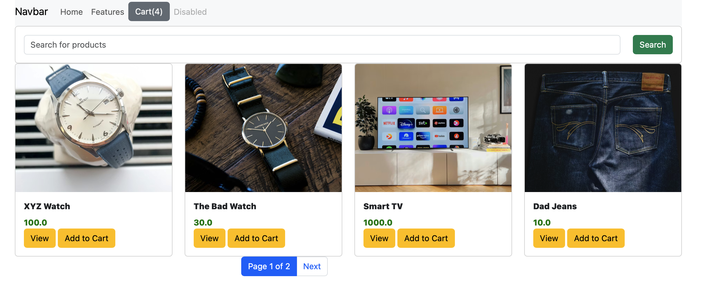

# Django E-Commerce Store

#### Current status: Complete

___

### Personal Progress
* **What I learned**: Working with browser Local Storage for cart persistence, integrating jQuery for dynamic frontend functionality, leveraging Bootstrap components for responsive design, and customizing the Django admin panel for better product management
* **What I wish I had done differently**: Cleaned up the default Bootstrap components and HTML pages more thoroughly to create a more polished, unique design
* **What I am most proud of**: Finding and fixing a bug in the add to cart before it was covered in a later lecture
* **What I want to learn next**: Continue working through the course to build on these fundamental skills

## Description
This is an e-commerce store application built as a project in the [Python and Django Framework Complete Course](https://www.udemy.com/course/django-course/). The application allows users to browse products, add items to a shopping cart using Local Storage, search and filter products, and complete orders through a checkout form. The project demonstrates Django fundamentals, JavaScript/jQuery integration, and Bootstrap styling.



## Features

- **Product Catalog**: Browse products with images, descriptions, and pricing displayed in a responsive grid layout
- **Shopping Cart**: Client-side cart functionality using Local Storage with jQuery to add/remove items and persist across sessions
- **Product Search**: Real-time search functionality to filter products by name
- **Pagination**: Navigate through product listings with Bootstrap-styled pagination
- **Product Details**: Dedicated detail pages for each product with full information
- **Checkout System**: Complete order form with customer information and order persistence to the database
- **Custom Admin Panel**: Enhanced Django admin interface for managing products and viewing orders

## Technical Stack

**Framework & Core Technologies**:
- **Django 6.0**: Full-stack web framework
- **SQLite**: Database for products and orders
- **Python 3.x**: Backend programming language

**Frontend**:
- **Bootstrap**: Responsive CSS framework for UI components
- **jQuery**: JavaScript library for DOM manipulation and cart functionality
- **Local Storage**: Browser storage for cart persistence

**Key Features Implemented**:
- Django ORM for database operations
- Function-based views for all pages
- Template rendering with context data
- Product search with Django querysets
- Pagination using Django Paginator
- Form handling for checkout
- Custom admin panel configuration
- Static file management

## Application Structure

The project consists of a single Django app called `shop` that handles all e-commerce functionality:

**Models** (`shop/models.py:4-30`):
- `Product`: Stores product information including name, description, category, price, discounted price, and image URL
- `Order`: Stores customer orders with items, total, and shipping information

**Views** (`shop/views.py:7-41`):
- `index`: Product listing with search and pagination
- `detail`: Individual product detail page
- `checkout`: Order processing and form handling

**Key Implementation Details**:

**Product Search** (`shop/views.py:11-13`):
```python
item_name = request.GET.get('item_name')
if item_name != '' and item_name is not None:
    product_objects = product_objects.filter(name__icontains=item_name)
```
Filters products based on user search input with case-insensitive matching.

**Pagination** (`shop/views.py:16-18`):
```python
paginator = Paginator(product_objects, 4)
page = request.GET.get('page')
product_objects = paginator.get_page(page)
```
Displays 4 products per page for better user experience.

**Order Processing** (`shop/views.py:28-39`):
Order data is collected from the checkout form and saved to the database, with cart items stored as a JSON string.

## License

This project is a learning exercise and is available for reference under the [MIT License](LICENSE).